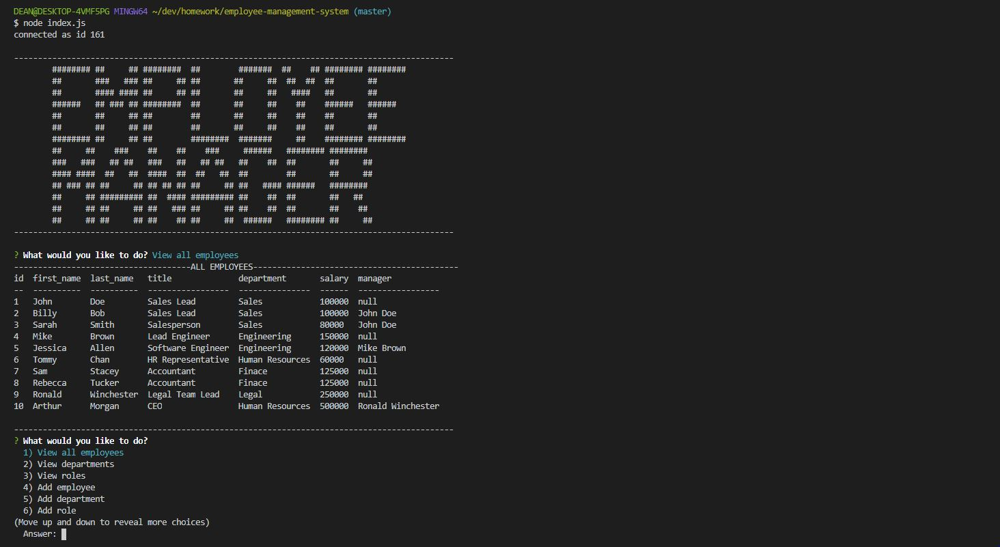

# Employee Manager System 
   

  This project allows a manager to manage their employees! The user can cycle through several differnt options to view differnt sets of data, add data, update data, and delete data! This program is made using Node.js and MySQL.

  

  ## Table of Contents

  - [Installation](#installation)
  - [Usage](#usage)
  - [License](#license)
  - [Contributing](#contributing)
  - [Tests](#tests)
  - [Questions](#questions)

  ## Installation

  Run node index.js to start to program, the mySQL data base must be set up first on your local server.

  ## Usage

  This program uses Inquirer to ask the user different question. The user can: 

  - view all employees
  - view all departmenst
  - view all roles 
  - add an employee
  - add a department
  - add a role
  - update an employee role
  - delete an employee!
  
  The data base is set up in MySQL and the schema and seed files are provided in the db folder.

  

  ## License

  This aplication is made with the [MIT License](https://opensource.org/licenses/MIT)

  ## Contributing

  To contribute please contact me!

  ## Tests

  If you find any problems or errors please contact me!

  ## Questions

  For any questions you might have, you can email me at wilsoncollin7@gmail.com. You can also check out my [GitHub Profile](https://github.com/wilsoncollin7).

